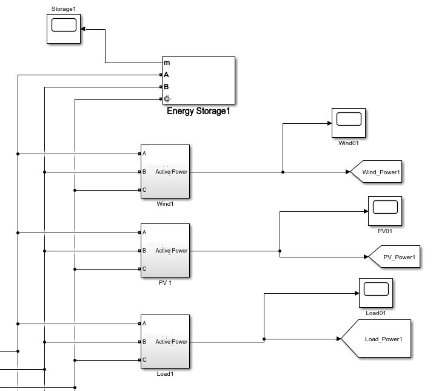
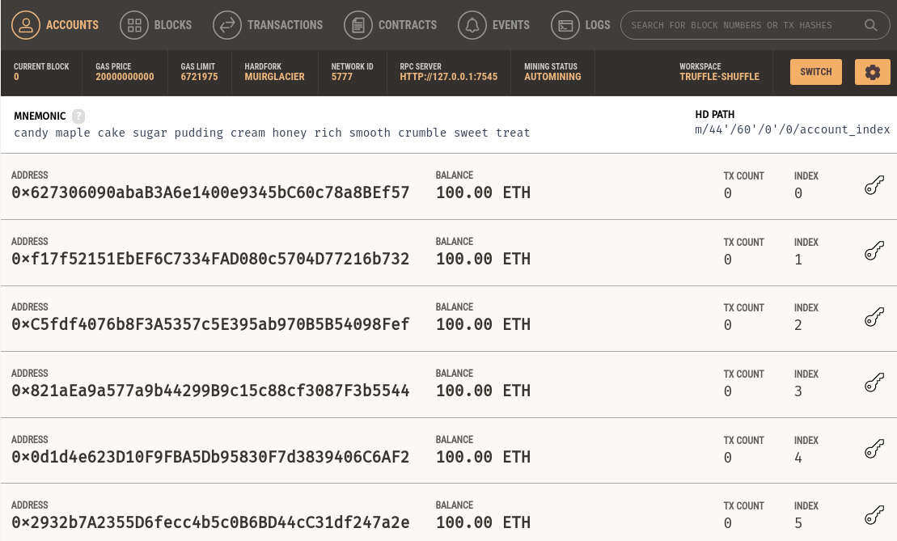
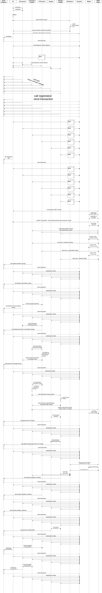

# Ethereum energy trading platform using multi-agents systems
It is my master's work project with topic:
"The management system development of microgrid using blockchain technology"

## Table of contents

* [Introduction](#introduction)
* [Technologies](#technologies)
* [General info](#general-info)
* [Sources](#sources)

## Introduction
There are such consumers groups, which don’t link with centralize electricity system.
These local groups of consumers need own microgrids. It is necessary to use new management systems for microgrids.
The management system with using blockchain technology allows us to manage energy trading effectively using
smart contracts system. Ethereum is a gold standard among a lot of blockchain platforms. Many trading platforms of renewable energy sources use Ethereum. For example :
- Power Ledger
- Brooklyn Microgrid
- Piclo and etc.

I’ve explored Ethereum platform and developed a management system
for my own microgrid model.

## Technologies
Project created with:
* Java version: 15
* Solidity version: 0.5.17
* Web3j library version: 4.5.0
* org.eclipse.paho version: 1.2.5
* jade library version: 4.5.0
* Ganache
* Matlab
* IntelliJ IDEA

## General Info
One part of my microgrid model from PC Matlab:

I exchanged data between my management system and Matlab using UDP and MQTT protocol.
Smart Contracts for my system were written with Solidity language. I developed a smart contract
system with three contracts:
- main contract - management production/consumption energy and payment for energy
- service contract - management service payment for storage energy
- penalty contract - management for penalty payment

For building my management system programming architecture
I’ve used multi agents systems.

I‘ve also used a special app for creating my own Ethereum blockchain - Ganache:

Ganache allows us to deploy and test smart contracts and user dApps.
Sequence diagram for my system is presented below.

## Sources
This project was created thanks to the book "Blockchain in Action" by Bina Ramamurthy and
Ethereum homestead documentation by [ethereum tutorial](https://ethdocs.org/en/latest/)
